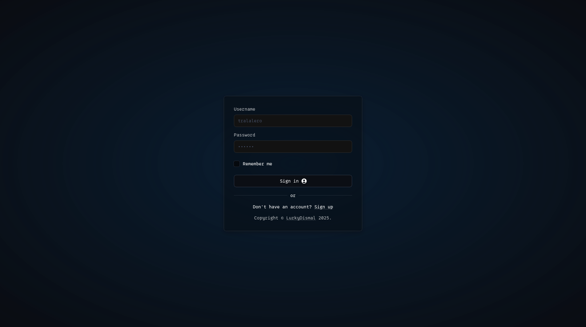
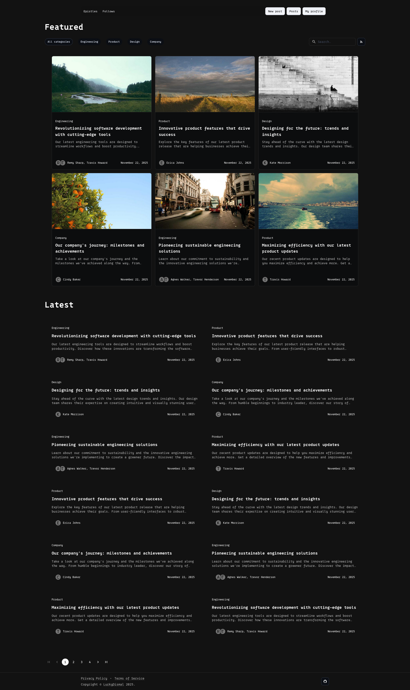
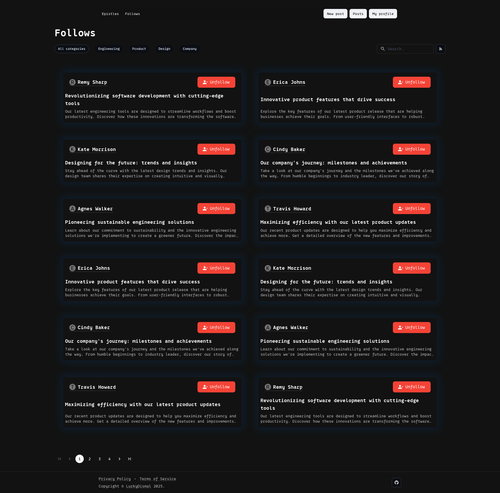
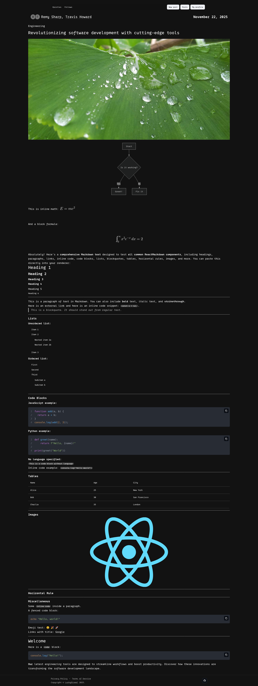
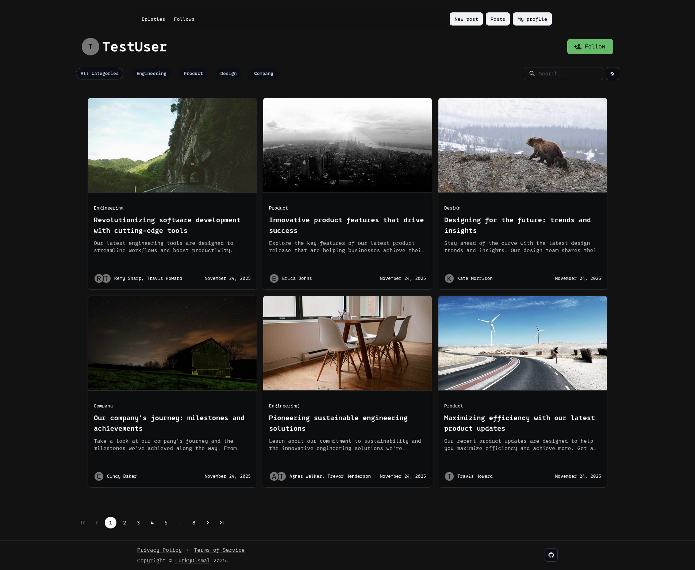

<!-- :toc: macro -->
<!-- :toc-title: -->
<!-- :toclevels: 99 -->

# vigilant-funicular <!-- omit from toc -->

> TODO

## Table of Contents <!-- omit from toc -->

* [General Information](#general-information)
* [Technologies Used](#technologies-used)
* [Features](#features)
* [Setup](#setup)
* [Usage](#usage)
* [Project Status](#project-status)
* [Room for Improvement](#room-for-improvement)
* [Acknowledgements](#acknowledgements)
* [License](#license)

## General Information

TODO

Why I made it:

* TODO

## Technologies Used

* TODO

## Features

* TODO

## Screenshots

## Setup

Requirements/ dependencies:

* TODO

Installation:

* TODO

## Usage

TODO

## Project Status

Project is: _in progress_.

## Room for Improvement

Room for improvement:

* TODO

To do:

* TODO

## Acknowledgements

* TODO

## License

This project is open source and available under the
[GNU Affero General Public License v3.0](LICENSE).
